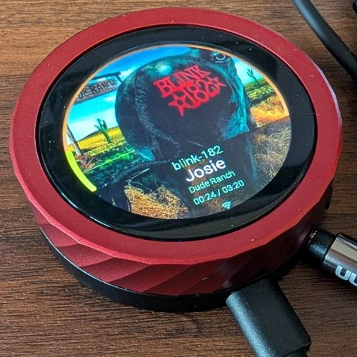

# RedSmartKnob

This repository provides an ESPHome based firmware for an ESP32 based media
player, either controlling a Music Assistant Media Player via Home Assistant,
and optionally also having this device _be_ the sendspin media player via local
audio AUX output. This was inspired heavily by
https://github.com/RealDeco/sendspin-guition.

## Screenshots

|  |  |
|:---:|:---:|
| *Red Smart Knob, the repo's namesake.* | *Silver Puck, running off a QI charger.* |

## Expectations

This firmware expects use of ESPHome, Home Assistant and Music Assistant. Note
that any configuration requesting an HA Media Player should provide the entity
id pointing to the Music Assistant variant of that media player for best
results.

## How to use this

This firmware comes in two modes:

  - Sendspin mode: the device _is_ the media player (e.g. use the AUX out)
  - Controls mode: the device controls a remote Music Assistant Media Player

There each device also provides `*.dev.yaml` files for local development, or to assign passwords and encryption via `secrets.yaml`.

Once flashed, be sure to:

  - Add the device in Home Assistant
  - Enable "Allow the device to perform Home Assistant actions" from the ESPHome integration overview. [Screenshot](screenshots/homeassistant-perform-actions.png)
  - Configure the device in Home Assistant, to set the relevant entity ids. The device will reboot to enact the changes.

NOTE: If using TTS announcements, remember to use the Music Assistant `media_player` entity within Home Assistant, rather than the device directly. MA will handle the audio stream format mismatches much more gracefully.

## Supported Devices

Follow the Flash links to install.

<table>
  <thead>
    <tr>
        <th>Device model</th>
        <th>Image</th>
        <th>Description</th>
        <th>Details</th>
        <th>Flash It!</th>
    </tr>
  </thead>
  <tbody>
    <tr>
      <td><ul>
        <li>Guition JC3636K518C</li>
        <li>WaveShare ESP32-S3-Knob-Touch-LCD-1.8</li>
      </ul></td>
      <td></td>
      <td>1.8" ESP32-S3 Rotary Knob (Red, Blue or Black)</td>
      <td><a href="devices/guition-redknob-jc3636k518c/README.md">Details</a></td>
      <td> 
    </tr>
    <tr>
      <td><ul>
        <li>Guition JC3636W518C</li>
      </ul></td>
      <td></td>
      <td>1.8" ESP32-S3 Silver Puck</td>
      <td><a href="devices/guition-silverpuck-jc3636w518c/README.md">Details</a></td>
      <td> 
    </tr>
  </tbody>
</table>

## References and Inspirations

  - https://github.com/RealDeco/sendspin-guition
  - https://github.com/KrX3D/WaveShare-Knob-ESp32S3 - esphome setup w/ display, HA media player.
