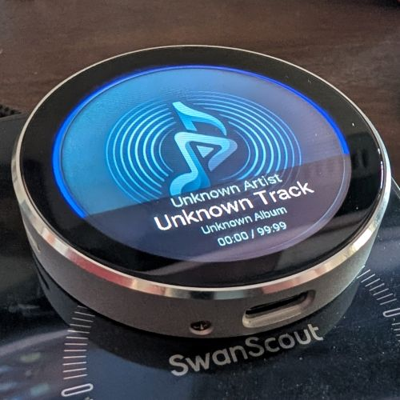

# Guition 1.8" Silver Puck v2

This directory supports an ESPHome configuration for a Guition JC3636W518C\_I\_Y silver 1.8" puck with an ESP32-S3 chip.

## Where To Get

 - [AliExpress](https://www.aliexpress.us/item/3256807152276100.html)

## How to use this

1. Edit `esphome.yaml` to set your device names, home assistant entities, and local vs remote mediplayer choice.
1. Copy `secrets.yaml.example` to `secrets.yaml` and edit it as appropriate for your setup.
1. Compile and flash your device: `esphome run esphome.yaml`
1. Add the device in Home Assistant
1. If using sendspin, then you should already see your device in Music Assistant too. Play some music!

NOTE: If using TTS announcements, remember to use the Music Assistant `media_player` entity within Home Assistant, rather than the device directly. MA will handle the audio stream format mismatches much more gracefully.

## Device Notes

This device (GUITION `JC3636W518C_I_Y`, silver puck device) has a single ESP32-S3 chip.

  - Silver round case
  - 1.8" 360x360 TFT LCD display (`JC3636W518V2`, driver chip `ST77916`, touchscreen `CST816`)
  - a single ESP32-S3 chip
  - 512KB SRAM, 384KB ROM, 8M PSRAM, 16M Flash
  - Powered by USB-C or QI (Wireless Charging). No battery.
  - PCM5100 DAC with 3.5mm AUX Audio Line Out
  - No rotary knob
  - No power toggle switch
  - No haptic feedback
  - Accessible TF / SD card
  - Microphone

## References

  - Manufacturer References
    - https://pan.jczn1688.com/directlink/1/HMI%20display/JC3636W518EN.zip?lang=en
  - For this model
    - https://github.com/RealDeco/sendspin-guition "Silver Puck v2"
